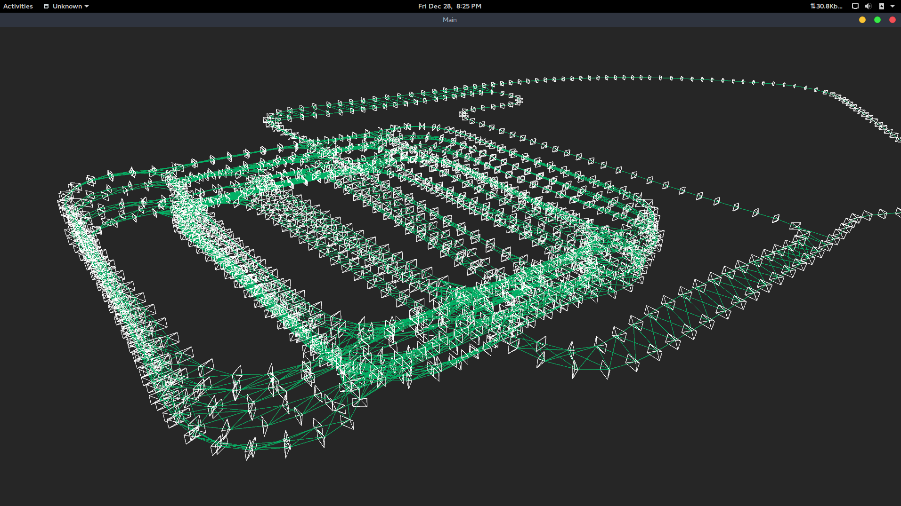

g2o-experiments
---
no clue what im doing, just trying to figure out how g2o works

[notes](notes.md)
---

TODO
---
 - create SimpleViewer class
 - start working on optimization

dependencies
---
 - numpy
 - [pangolin (python bindings)](https://github.com/uoip/pangolin)
 - [g2opy](https://github.com/uoip/g2opy)
 - python 2.7

license
---
my code's MIT licensed, but please attribute my work if you found it useful.
 - g2o/g2opy, BSD Licensed
 - [citations for dataset](data/dataset.md)

 [uoip](https://github.com/uoip) is a real G.
